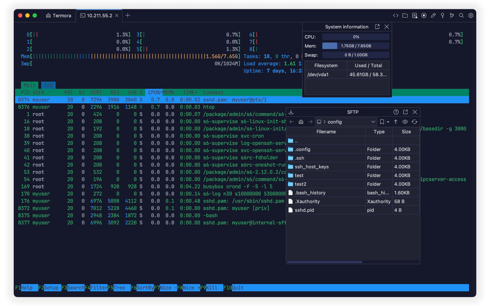
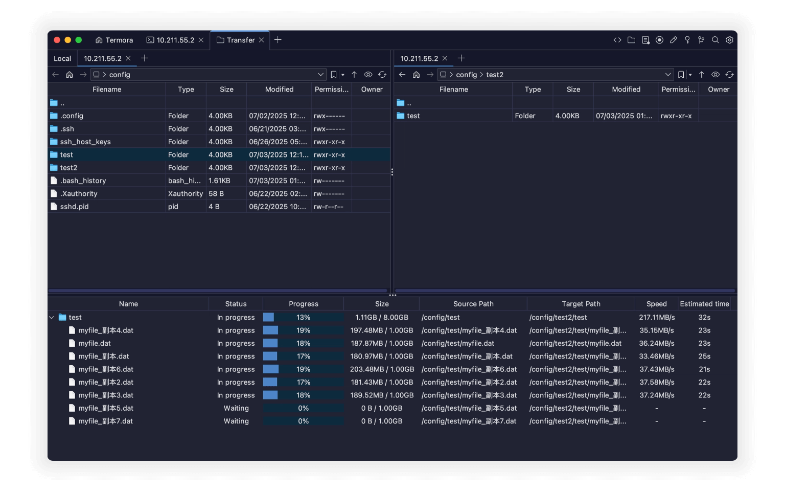
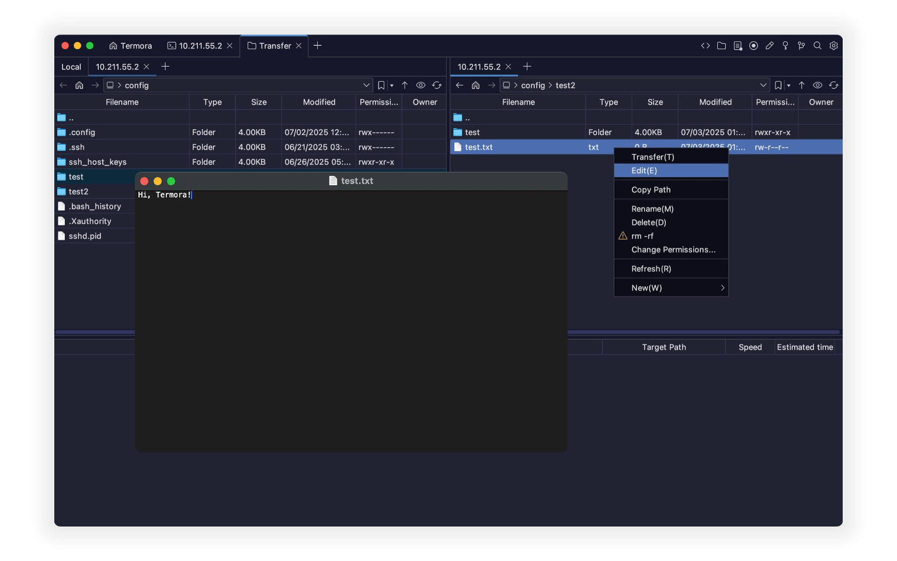
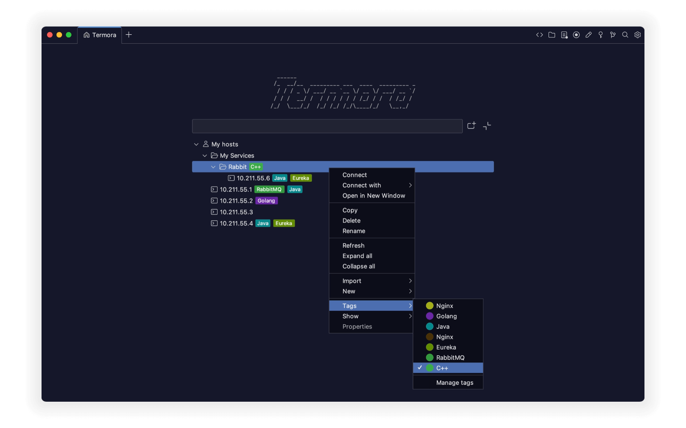

<a href="./README.md">English</a> | <a href="./README.zh_CN.md">简体中文</a> | <a href="./README.pt_BR.md">Português (Brasil)</a>

# Termora

**Termora** ist ein plattformübergreifender Terminal-Emulator und SSH-Client für **Windows, macOS und Linux**.

  

Termora wird mit [**Kotlin/JVM**](https://kotlinlang.org/) entwickelt und implementiert Teile des [**XTerm-Control-Sequence-Protokolls**](https://invisible-island.net/xterm/ctlseqs/ctlseqs.html). Langfristig verfolgt das Projekt das Ziel, über [**Kotlin Multiplatform**](https://kotlinlang.org/docs/multiplatform.html) eine umfassende Plattformunterstützung zu ermöglichen — einschließlich Android, iOS und iPadOS.

## ✨ Funktionen

- 🧬 Plattformübergreifende Unterstützung
- 🔐 Integrierte Schlüsselverwaltung
- 🖼️ X11-Forwarding
- 🧑‍💻 SSH-Agent-Integration
- 💻 Anzeige von Systeminformationen
- 📁 Grafische SFTP-Dateiverwaltung
- 📊 Überwachung der Nvidia-GPU-Auslastung
- ⚡ Schnellzugriff auf häufig genutzte Befehle

## 🚀 Dateiübertragung

- Direkte Übertragungen zwischen Server A ↔ B
- Unterstützung für rekursive Ordnerübertragungen
- Bis zu **6 parallele Übertragungsaufgaben**

  

## 📝 Dateien bearbeiten

- Automatischer Upload nach dem Bearbeiten und Speichern
- Dateien und Ordner umbenennen
- Große Ordner schnell löschen (`rm -rf` wird unterstützt)
- Berechtigungen übersichtlich bearbeiten
- Neue Dateien und Ordner erstellen

  

## 💻 Hosts

- Hierarchische Baumstruktur, ähnlich wie bei Ordnern
- Tags für einzelne Hosts vergeben
- Hosts aus anderen Tools importieren
- Direkt mit dem Dateiübertragungs-Tool öffnen

  

## 🧩 Plugins

- 🌍 Geo: Standortinformationen von Hosts anzeigen
- 🔄 Sync: Einstellungen mit Gist oder WebDAV synchronisieren
- 🗂️ WebDAV: Verbindung zu WebDAV-Speicher herstellen
- 📝 Editor: Integrierter Editor für SFTP-Dateien
- 📡 SMB: Verbindung zu [SMB](https://en.wikipedia.org/wiki/Server_Message_Block) herstellen
- ☁️ S3: Verbindung zu S3-Objektspeicher herstellen
- ☁️ Huawei OBS: Verbindung zu Huawei Cloud OBS herstellen
- ☁️ Tencent COS: Verbindung zu Tencent Cloud COS herstellen
- ☁️ Alibaba OSS: Verbindung zu Alibaba Cloud OSS herstellen
- 👉 [Alle Plugins ansehen...](https://www.termora.app/plugins)

## 📦 Download

- 🧾 [Neueste Version](https://github.com/TermoraDev/termora/releases/latest)
- 🍺 **Homebrew**: `brew install --cask termora`
- 🔨 **WinGet**: `winget install termora`
-  <b>Microsoft Store</b>: <a href="https://apps.microsoft.com/store/detail/9NRZBHG43SB9?cid=DevShareMCLPCS">Termora im Microsoft Store ansehen</a>

## 🛠️ Entwicklung

Für die Entwicklung empfehlen wir das [JetBrainsRuntime](https://github.com/JetBrains/JetBrainsRuntime) JDK.

- Lokal starten: `./gradlew :run`

## 📄 Lizenz

Diese Software wird unter einem Dual-License-Modell veröffentlicht. Du kannst eine der folgenden Optionen wählen:

- **AGPL-3.0**: Die Software darf gemäß den Bedingungen der [AGPL-3.0](https://opensource.org/license/agpl-v3) genutzt, verteilt und verändert werden.
- **Proprietäre Lizenz**: Für Closed-Source- oder proprietäre Nutzung kontaktiere bitte den Autor, um eine kommerzielle Lizenz zu erhalten.
