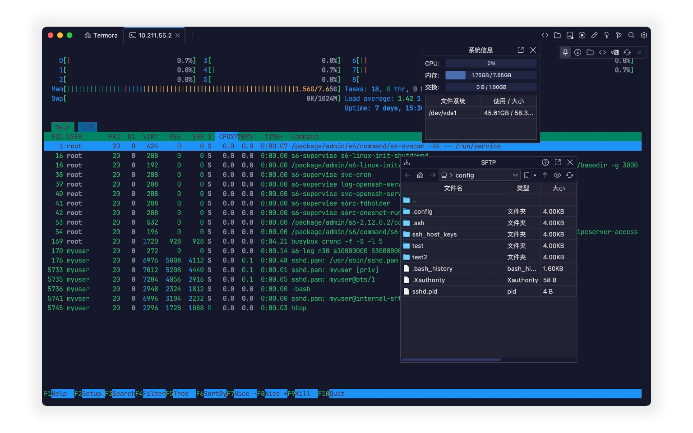
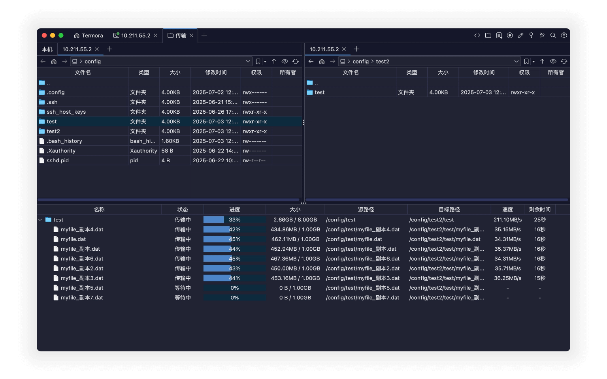
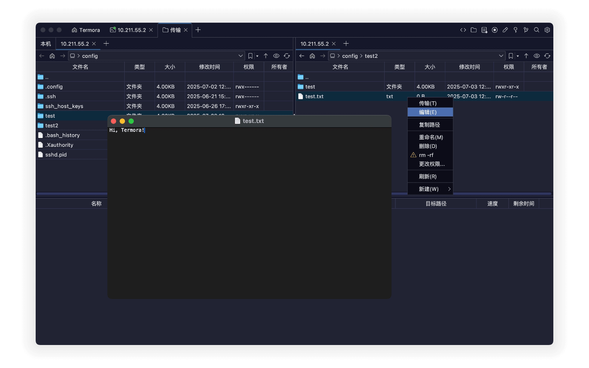
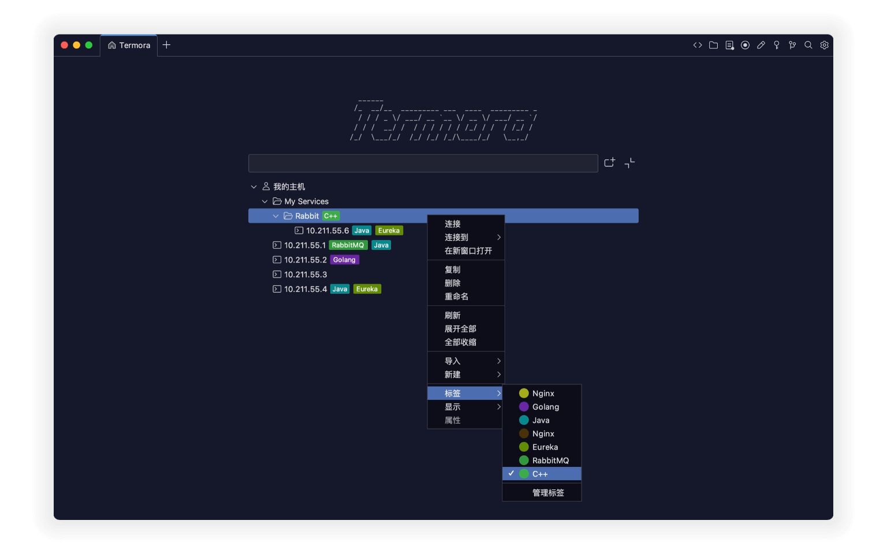

# Termora

**Termora**는 **Windows, macOS, Linux**를 지원하는 크로스 플랫폼 터미널 에뮬레이터이자 SSH 클라이언트입니다.

  

Termora는 [**Kotlin/JVM**](https://kotlinlang.org/)으로 개발되었으며, [**XTerm 제어 시퀀스 프로토콜**](https://invisible-island.net/xterm/ctlseqs/ctlseqs.html)을 지원(구현 중)합니다. 향후 목표는 [**Kotlin Multiplatform**](https://kotlinlang.org/docs/multiplatform.html)을 활용하여 Android, iOS, iPadOS 등을 포함한 **모든 플랫폼을 지원**하는 것입니다.

## ✨ 주요 기능

- 🧬 크로스 플랫폼 구동
- 🔐 내장 키 관리자
- 🖼️ X11 포워딩 지원
- 🧑‍💻 SSH-Agent 연동
- 💻 시스템 정보 표시
- 📁 그래픽 SFTP 파일 관리
- 📊 Nvidia 그래픽 카드 점유율 확인
- ⚡ 빠른 명령(Snippets) 지원

## 🚀 파일 전송

- 서버 간(A ↔ B) 직접 전송 지원
- 폴더 재귀 복사 지원
- 최대 **6개의 전송 작업** 동시 실행 가능

  

## 📝 파일 편집 기능

- 저장 시 수정 내용 자동 업로드
- 파일 / 폴더 이름 변경
- 대용량 폴더 빠른 삭제: `rm -rf` 지원
- 시각적 권한 변경
- 새 파일 / 폴더 생성 지원

  

## 💻 호스트

- 폴더 트리 구조와 유사
- 호스트에 태그 추가
- 다른 소프트웨어에서 가져오기
- 전송 도구로 열기

  

## 🧩 플러그인

- 🌍 Geo: 호스트 위치 정보 표시
- 🔄 Sync: 구성을 Gist 또는 WebDAV와 동기화
- 🗂️ WebDAV: WebDAV 오브젝트 스토리지 연결
- 📝 Editor: 내장 SFTP 파일 편집기
- 📡 SMB:  [SMB](https://baike.baidu.com/item/smb/4750512) 파일 공유 프로토콜 연결
- ☁️ S3: S3 오브젝트 스토리지 연결
- ☁️ Huawei OBS: Huawei Cloud 오브젝트 스토리지 연결
- ☁️ Tencent COS: Tencent Cloud COS 연결
- ☁️ Alibaba OSS: Alibaba Cloud OSS 연결
- 👉 [모든 플러그인 보기...](https://www.termora.cn/plugins)

## 📦 다운로드

- 🧾 [최신 릴리스 (Latest release)](https://github.com/TermoraDev/termora/releases/latest)
- 🍺 **Homebrew**: `brew install --cask termora`
- 🪟 **WinGet**: `winget install termora`
-  <b>Microsoft Store</b>: <a href="https://apps.microsoft.com/store/detail/9NRZBHG43SB9?cid=DevShareMCLPCS">Termora</a>

## 🛠️ 개발 가이드

[JetBrainsRuntime](https://github.com/JetBrains/JetBrainsRuntime) JDK 런타임 환경 사용을 권장합니다.

- 로컬 실행: `./gradlew :run`

## 📄 라이선스

Termora는 이중 라이선스 방식을 채택하고 있으며, 다음 중 선택할 수 있습니다:

- **AGPL-3.0**: 자유로운 사용, 수정, 배포 ([AGPL 조항](https://opensource.org/license/agpl-v3) 준수)
- **독점 라이선스(Proprietary)**: 비공개 소스 또는 상업적 용도가 필요한 경우 제작자에게 문의하여 라이선스를 취득하세요.
